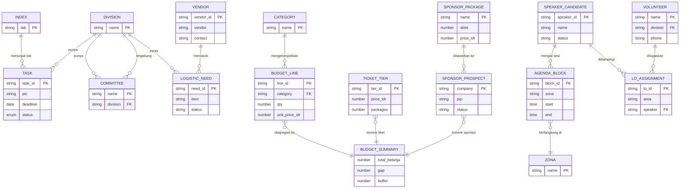

# Data Model — Planning Trix (ERD + Data Plan)

- Status: Draft 0.2
- Tanggal: 27 Sep 2026
- Pasangan: `PRD.md`, `SYSTEM-DESIGN.md`

Dokumen ini mendefinisikan entitas, relasi (ERD), sumber kebenaran, formula,
konvensi UX, dan rencana data. Semua perubahan skema dijalankan di **salinan
dev**, bukan production.

---

## 1. Prinsip Data

1. **Satu sumber kebenaran per entitas.** Tidak ada dua tab menyimpan angka yang
   sama kecuali salah satunya turunan berformula.
2. **Input vs turunan dipisah.** Input = diketik/divalidasi; turunan = formula.
3. **Nama tab straight-forward** (tanpa `Draft`/`2026`); tahun hanya di arsip.
4. **Foreign key by name**, bukan baris. Relasi dijaga lewat kolom kunci stabil
   (mis. `task_id`, `speaker_id`, `tab`).
5. **Satu fakta satu sel.** Jangan gabung beberapa fakta dalam satu sel.

## 2. Entitas & Atribut (logical schema)

Kolom bertanda **PK** = primary key, **FK** = referensi ke entitas lain.

### 2.1 Index (tab `Index & Standar`)

| Field | Tipe | Catatan |
| --- | --- | --- |
| tab (PK) | string | Nama tab |
| kind | enum | Aktif / Referensi / Arsip |
| purpose | string | Isi/fungsi |
| owner | string | PIC |
| action | string | Aksi berikutnya |
| link | formula | `HYPERLINK` ke tab |

### 2.2 Event (tab `Overview`)

Field, value, remarks. Konsep tunggal (1 baris = 1 atribut event).

### 2.3 Task (tab `Task`)

| Field | Tipe | Catatan |
| --- | --- | --- |
| task_id (PK) | string | `T-001` |
| task | string | |
| division (FK → Division) | enum | |
| pic | string | wajib, `TBD` kalau belum |
| deadline | date | wajib, `TBD` kalau belum |
| priority | enum | High/Mid/Low |
| status (PK-enum) | enum | lihat bagian 4 |
| note | string | sumber + tanggal |

### 2.4 BudgetLine (tab `Budget`)

| Field | Tipe |
| --- | --- |
| line_id (PK) | string |
| category (FK → Category) | string |
| item | string |
| qty | number (input) |
| unit | string |
| unit_price_idr | number (input) |
| total_idr | **formula** = qty × unit_price |
| note | string |

### 2.5 BudgetSummary (tab `Budget In Out`) — view, bukan input

| Field | Sumber |
| --- | --- |
| subtotal_category | `SUMIF(Budget.category, ...)` |
| total_belanja | `SUM(Budget.total_idr)` |
| buffer_idr | input (kebijakan) |
| total_out | formula = belanja + buffer |
| income_google | input |
| income_ticket | formula = `Ticket.total` |
| income_sponsor | input |
| gap | formula = total_out − income |
| sponsor_target | formula = belanja − income |

### 2.6 TicketTier (tab `Tiket`)

| Field | Tipe |
| --- | --- |
| tier_id (PK) | string |
| name | string |
| includes | string |
| price_idr | number (input) |
| packages | number (input) |
| pax | **formula** = packages × pax_per_package |
| total_idr | **formula** = price × packages |
| note | string |

### 2.7 SponsorPackage / SponsorProspect (tab `Paket Sponsor`, `Target Partnership`)

- Package: name, slots, price_idr, potential_idr (formula = slots × price), note.
- Prospect: company (PK), pic, expected_usd, status (enum), link.

### 2.8 SpeakerCandidate (tab `Speaker Candidate`) / SpeakerReference (tab `REF - Speaker`)

- Candidate: speaker_id (PK), name, topic, role, pic, status (enum), note.
- Reference: name (PK), roles, note (bukan data aktif).

### 2.9 Committee / Volunteer (tab `Commitee`, `Volunteer`)

- name (PK), division (FK), role, phone, email, size_tshirt.
- Satu sumber kebenaran orang: `Volunteer` (punya nomor); `Commitee` referensi.

### 2.10 LogisticNeed / Vendor (tab `Logistic Needs`, `Logistic Vendor`)

- Need: need_id (PK), division, item, qty, status (enum bayar), note.
- Vendor: vendor_id (PK), item, vendor, contact, link, note, price.

### 2.11 AgendaBlock (tab `Agenda`)

- block_id (PK), zona (enum), start, end, duration (formula = end − start),
  session, format, pic, note.

### 2.12 LOAssignment (tab `Job on Stage`)

- lo_id (PK), name, contact, origin, role, status, note.
- assignment: area (FK), session, speaker (FK → SpeakerCandidate), lo (FK).

### 2.13 Entitas pendukung

- MediaPartner, TargetPartnership, SpeakerQuestion, Doorprize, Venue,
  Documentation, MoM (minutes), RevisionLog.

## 3. ERD

Relasi kunci: `BudgetSummary` **tidak menyimpan** total belanja sebagai input —
nilainya agregasi dari `BudgetLine` + `TicketTier` + input sponsor. Ini yang
menghilangkan kelas error "angka sama beda tempat".

## 4. Enum Kanonik

### 4.1 Status tugas (6)

`Belum Mulai | Proses | Terblokir | Selesai | Batal | N/A`

Peta dari nilai lama:

| Lama | Baru |
| --- | --- |
| Not Started, To do | Belum Mulai |
| In-Progress, In Progress, On Progress, PROCESS, Doing | Proses |
| Done, Completed | Selesai |
| Aktif | Selesai (atau N/A untuk entitas non-tugas) |
| LUNAS | Lunas (enum bayar) |
| TBC | Belum Mulai + catatan |

### 4.2 Status bayar (3)

`Belum Bayar | DP | Lunas`

### 4.3 Zona (3)

`Main Hall | Workshop | Auditorium`

### 4.4 Prioritas (3)

`High | Mid | Low`

## 5. Rencana Formula (spreadsheet, bukan kode)

| Tab | Sel/kolom | Formula |
| --- | --- | --- |
| Budget | `total_idr` | `=Grow_qty*Grow_unit_price` |
| Budget | subtotal kategori | `=SUMIF($A:$A, kategori, $F:$F)` |
| Budget In Out | total belanja | `=SUM(Budget.F)` |
| Budget In Out | total_out | `=belanja + buffer` |
| Budget In Out | gap | `=total_out - income_total` |
| Budget In Out | sponsor target | `=belanja - income_tanpa_sponsor` |
| Tiket | pax | `=packages * pax_per_package` |
| Tiket | total | `=price * packages` |
| Tiket | avg/pax | `=SUM(total)/SUM(pax)` |
| Agenda | duration | `=end - start` |
| Index | link | `=HYPERLINK("#gid=" & gid, tab)` |
| Task | hari ke deadline | `=deadline - TODAY()` + conditional format |

Aturan: sel turunan tidak boleh ditimpa manual. Kalau perlu override, tulis
alasannya di kolom note dan tandai warna khusus.

## 6. Konvensi UX Spreadsheet

1. **Warna tab** per divisi (Program, Logistik, Partnership, Marketing, Finance,
   Arsip abu-abu).
2. **Header block 3 baris** di setiap tab; baris 4 = header kolom; freeze.
3. **Warna sel**: input = putih, formula = abu muda, warning/telat = oranye,
   arsip = abu.
4. **Dropdown** (data validation) untuk semua kolom enum: status, prioritas,
   zona, divisi, status bayar.
5. **Conditional formatting**: deadline lewat → merah; status `Selesai` → hijau;
   `Terblokir` → kuning.
6. **Format angka**: `Rp#,##0` untuk uang, `dd Mmm yyyy` untuk tanggal,
   `+62 ...` untuk HP (selalu text `RAW`).
7. **Index tab** dengan `HYPERLINK` ke semua tab + kolom kind/owner/action.
8. Satu baris = satu record; tidak ada baris kosong di tengah blok data.

## 7. Naming Convention

- Tab: `Overview`, `Index & Standar`, `Budget`, `Budget In Out`, `Tiket`,
  `Paket Sponsor`, `Speaker Candidate`, `REF - Speaker`, `Task`, `Logistic Needs`,
  `Logistic Vendor`, `Agenda`, `Job on Stage`, `Commitee`, `Volunteer`, `Media Partner`.
- Tanpa `Draft`, tanpa `2026`. Arsip: `<Nama> (Arsip 2025)`.
- Field kanonik: `snake_case` di registry; header sheet boleh Title Case.
- Prefix kode: Tab `T-`, Speaker `S-`, LO `LO-`, Need `N-`.

## 8. Data Quality Rules

1. PIC + deadline wajib; `TBD` eksplisit kalau belum ada.
2. Status harus ada di enum; validator menolak nilai luar enum saat tulis.
3. Tidak ada angka sama di dua tempat kecuali lewat formula.
4. Tanggal tidak ambigu (`9/5` ditandai `ambiguous`, tidak ditebak).
5. Nomor HP satu format `+62 ...` (text).
6. Baris arsip tidak ditulis agent.
7. Konflik angka → `conflicts[]` + lapor PIC, jangan auto-pilih.

## 9. Rencana Migrasi (di salinan dev, bukan production)

1. Copy spreadsheet → dev; verifikasi jumlah tab + baris sama.
2. Rename tab ke convention (bagian 7); tab lama jadi `(Arsip 2025)`.
3. Tambah header block 3 baris + freeze + dropdown enum.
4. Ubah kolom turunan jadi formula (bagian 5); hapus nilai manual.
5. Migrasi status lama → enum kanonik.
6. Bikin `Index & Standar` dengan hyperlink + kind/owner.
7. Validasi: angka dev = angka prod untuk data 2026 yang sama.
8. Cutover setelah approval (checklist PRD bagian 12).