# Data Model — Planning Trix (ERD + Data Plan)

- Status: Draft 0.3
- Tanggal: 27 Sep 2026
- Pasangan: `PRD.md`, `SYSTEM-DESIGN.md`

Dokumen ini mendefinisikan hierarki data, entitas, relasi (ERD), enum kanonik,
formula turunan, aturan kualitas, dan rencana migrasi. Semua perubahan skema
dijalankan di **salinan dev**, bukan production.

---

## 0. Perubahan 0.3 (feedback Kak Farhan, 27 Sep 2026)

1. **Dimensi event ditambah.** Planning Trix ditulis **per event** di folder
   Drive sendiri, jadi hierarki resmi: `Portfolio → Event → Spreadsheet → Tab`.
   Event adalah akar semua data; tidak ada lagi "tahun" yang mengambang.
2. **Committee + Volunteer = satu entitas `ORGANIZER`.** Panitia inti dan
   volunteer beda **peran/penugasan**, bukan beda orang. Ditambah relasi
   `ASSIGNMENT` supaya orang bisa isi beberapa role dalam satu event.
3. **ERD diperluas** dari 17 → 58 entitas, hasil recon 4 Planning Trix lain
   (DevFest 2025, Cloud Next 2026, JuaraGCP 2026, Cloud Roadshow) + Templates +
   Master Data.
4. **Entity baru** yang tadinya tidak ada sama sekali: `EVENT`, `ASSIGNMENT`,
   `PAYMENT`, `PURCHASE_ORDER`, `PARTICIPANT`, `REGISTRATION`, `SESSION`,
   `RISK`, `COMPANY`, `PARTNERSHIP_DEAL`, `QUEST_MISSION`, `REWARD`,
   `OBJECTIVE`/`KEY_RESULT`, `DESIGN_TASK`, `DOC_ASSIGNMENT`, `REPORT_METRIC`,
   `VENDOR_RESEARCH`, `SHIRT_SIZE`, `REVISION_LOG`.
5. **`TabKind`** (Aktif/Referensi/Arsip/Draft/Turunan) jadi atribut eksplisit
   di `EVENT_TAB`, plus relasi `derived_from` untuk tab kembar.
6. Typo `pip` → `pic` di `SPONSOR_PROSPECT`; prospek sponsor dipecah jadi
   `COMPANY` + `PARTNERSHIP_DEAL` supaya satu perusahaan tidak diduplikasi
   saat jadi sponsor **dan** media partner.

---

## 1. Prinsip Data

1. **Satu sumber kebenaran per entitas.** Tidak ada dua tab menyimpan angka yang
   sama kecuali salah satunya turunan berformula.
2. **Satu spreadsheet per event.** Data 2025 tidak boleh tinggal di tab event
   2026; ia jadi `EVENT` lain dengan file sendiri. Event lintas tahun = event
   berbeda (aturan dari Kak Farhan).
3. **Input vs turunan dipisah.** Input = diketik/divalidasi; turunan = formula.
4. **Nama tab straight-forward** untuk data aktif; label arsip/draft hanya untuk
   yang memang bukan data hidup.
5. **Foreign key by ID**, bukan baris. Relasi pakai kunci stabil (`event_id`,
   `organizer_id`, `task_id`, `company_id`).
6. **Satu fakta satu sel.** Jangan gabung beberapa fakta dalam satu sel.
7. **Orang itu satu.** Nama orang sama tidak boleh jadi dua record; perbedaan
   "committee vs volunteer" diselesaikan lewat `ASSIGNMENT`.

---

## 2. Hierarki (dimensi event)

```
PORTFOLIO  (GDG Cloud Bandung)
└── EVENT                     1 event = 1 file Planning Trix + 1 folder Drive
    ├── EVENT_TAB             tab di dalam file itu
    ├── ZONA / ROOM           main hall, workshop, auditorium
    ├── ASSIGNMENT            siapa (ORGANIZER) pegang apa
    ├── SESSION / AGENDA      program acara
    ├── BUDGET / TICKET / PAYMENT
    ├── LOGISTIC / VENDOR / ORDER
    └── PARTNERSHIP / SPEAKER / PARTICIPANT
```

Konsekuensi aturan:

- Nama event **wajib** ada di baris 1 tiap tab: `<Judul tab> — <Nama Event> | Owner: <PIC>`.
- Tidak ada kolom "tahun" di entitas domain; tahun hanya atribut `EVENT`.
- Tool MCP menerima `event` (slug/id) sebagai parameter pertama yang eksplisit.
  Tidak ada default "event yang paling baru" untuk operasi tulis.

Katalog event yang sudah terverifikasi (recon 27 Sep 2026):

| slug | Event | Tahun | Folder Drive | Planning Trix (spreadsheet id) |
| --- | --- | --- | --- | --- |
| `devfest26` | DevFest Cloud Bandung | 2026 | `DevFest Cloud Bandung 2026` | `<SPREADSHEET_ID_DEVFEST26>` |
| `devfest25` | DevFest Cloud Bandung | 2025 | `Devfest Cloud 2025` | `<SPREADSHEET_ID_DEVFEST25>` |
| `devfest24` | Cloud DevFest Bandung | 2024 | `Devfest Cloud Bandung 2024` | — (Liquidation + Tracking terpisah) |
| `cloudnext26` | Cloud Next | 2026 | `Cloud Next 2026` | `<SPREADSHEET_ID_CLOUDNEXT26>` |
| `juaragcp26` | JuaraGCP | 2026 | `#JuaraGCP 2026` | `<SPREADSHEET_ID_JUARAGCP26>` |
| `roadshow` | Cloud Roadshow | 2025 | `Cloud Roadshow 2025` | `<SPREADSHEET_ID_ROADSHOW25>` |
| `iwd25` | IWD (WTM) | 2025 | `IWD 2025` | — |
| `master` | Master Data (lintas event) | — | `Volunteer` | `<SPREADSHEET_ID_MASTER>` |

Total: **2 event 2026 (DevFest + Cloud Next + JuaraGCP), 2 event 2025, 1 event
2024**; template resmi di folder `Templates` (Event Planner List + Asset
Inventory).

---

## 3. Enum kanonik

### 3.1 Status tugas (6)

`Belum Mulai | Proses | Terblokir | Selesai | Batal | N/A`

Peta nilai lama (11 variasi di temukan di audit):

| Lama | Baru |
| --- | --- |
| Not Started, To do, TBC | Belum Mulai |
| In-Progress, In Progress, On Progress, PROCESS, Doing, Soon | Proses |
| Done, Completed, Aktif | Selesai |
| Cancel | Batal |

### 3.2 Enum lain

| Enum | Nilai |
| --- | --- |
| `StatusBayar` | `Belum Bayar | DP | Lunas` |
| `Prioritas` | `High | Mid | Low` |
| `TabKind` | `Aktif | Referensi | Arsip | Draft | Turunan` |
| `Fase` | `Pra Event | Hari-H | Pasca Event` |
| `JenisEvent` | `DevFest | Cloud Next | JuaraGCP | IWD/WTM | Roadshow | BWAI | Study Jam | Tech Talk` |
| `TipeOrganizer` | `Core | Committee | Volunteer` |
| `PeranHari` | `Pre Day (PD) | The Day (D) | Both` |
| `TipeSpeaker` | `GDE | Google | Komunitas | Praktisi Lokal` |
| `StatusKontak` | `Belum Dikontak | Dihubungi | Dealing | Win | Batal` |
| `TipePartner` | `Sponsor | Media Partner | Community | In-Kind` |
| `StatusPesanan` | `Belum Pesan | Dipesan | Produksi | Selesai Produksi | Diambil` |
| `Kurasi` | `Select | Reject | Waitlist` |
| `Zona` | `Main Hall | Workshop | Auditorium | Foyer | Kids Zone` |
| `Format` | `Briefing | Preparation | Plenary | Techtalk | Workshop | Break | Closing` |
| `TipeRisk` | `Logistik/Tempat | Program | Keuangan | SDM | Eksternal | Teknis` |
| `Boolean` | `Ya | Tidak` (bukan TRUE/FALSE) |

---

## 4. Entitas & Atribut

Format: **PK** = primary key, **FK** = referensi. Tanda `ƒ` = kolom turunan
(formula sheet, bukan input).

### 4.1 Core / Event

**EVENT** (tab `Overview`)
| Field | Tipe | Catatan |
| --- | --- | --- |
| event_id (PK) | string | slug, mis. `devfest26` |
| name | string | nama resmi |
| jenis (FK → JenisEvent) | enum | |
| year | number | 2021…2026 |
| date | date | `28 Nov 2026` |
| time_range | string | `08:00–17:00` |
| venue_id (FK → VENUE) | string | |
| target_audience | string | |
| workshop_audience | string | |
| target_registrasi | number | satu angka saja, tidak boleh 2 versi |
| target_facilitators / target_speakers / target_partners | number | |
| ticket_model | enum | `Gratis | Berbayar | Hybrid` |
| status | enum | Belum Mulai…Selesai |
| spreadsheet_id | string | file Planning Trix |
| drive_folder_id | string | folder event |
| mom_link / bevy_link | url | |

**EVENT_REFERENCE** (tab `Overview` blok Resources & Forms) — referensi resmi
per event: brand guide, social kit, master slide, speaker request guide, cloud
credits guide, website, form (volunteer/registrasi/speaker/facilitator/feedback).

**EVENT_TAB** (tab `Index & Standar`)
| Field | Tipe |
| --- | --- |
| tab (PK) | string |
| kind (FK → TabKind) | enum |
| entity | string (nama entitas di dokumen ini) |
| purpose | string |
| issues | string |
| owner_pic | string |
| action | string |
| derived_from | string (FK → EVENT_TAB.tab, untuk tab kembar/turunan) |
| frozen | Ya/Tidak |
| gid | number |
| link ƒ | `HYPERLINK("#gid="&gid, tab)` |

**REVISION_LOG** — `revision_id (PK), event_id (FK), tanggal, tab, apa, sebelum, sesudah, oleh`.
Wajib append setiap tulis; tidak boleh menghapus history.

**VENUE** (tab `Venue List`, `Venue Candidate`, `Venue`)
| Field | Tipe |
| --- | --- |
| venue_id (PK) | string |
| name | string |
| capacity | number |
| location_url | url |
| address | string |
| price_idr | number |
| price_note | string |
| pic (FK → ORGANIZER) | string |
| deadline | date |
| pros / cons | text |
| status | enum |
| selected_for_event (FK → EVENT) | string (null = kandidat saja) |

**VENUE_FACILITY** — `venue_id (FK), facility (enum: Stage/Screen/Sound System/Chair/Waiting Room/Wifi/Parking/LED), available (Ya/Tidak), note`.

**VENUE_REQUIREMENT** — `event_id (FK), requirement, priority (High/Critical/Normal)`.

**ZONA / ROOM** (dulu "Zona") — `zona_id (PK), event_id (FK), venue_id (FK), name, setup, capacity, note`.

**COMPANY** (dipakai bersama oleh sponsor, media partner, community, vendor)
| Field | Tipe |
| --- | --- |
| company_id (PK) | string |
| name | string |
| category | string |
| address / phone / email | string |
| social_url | url |
| is_vendor | Ya/Tidak |

### 4.2 Organizer & SDM

**ORGANIZER** — satu entitas untuk committee **dan** volunteer.
| Field | Tipe | Catatan |
| --- | --- | --- |
| organizer_id (PK) | string | `ORG-001` |
| name | string | |
| email | string | |
| phone | string | `+62 ...` |
| origin | string | komunitas/kampus/instansi |
| occupation | string | |
| shirt_size | string | |
| long_sleeve | Boolean | |
| tipe (FK → TipeOrganizer) | enum | Core / Committee / Volunteer |
| joined_at | date | |
| status | enum | |
| note | string | |

**ASSIGNMENT** — penugasan orang di satu event (ini yang bikin "committee dan
volunteer bisa isi role yang sama" jadi eksplisit).
| Field | Tipe |
| --- | --- |
| assignment_id (PK) | string |
| event_id (FK → EVENT) | string |
| organizer_id (FK → ORGANIZER) | string |
| division_id (FK → DIVISION) | string |
| position | string (Ketua Event, MC, LO, Time Keeper, …) |
| scope (FK → PeranHari) | enum |
| pre_day_role / day_role | string |
| status | enum |
| note | string |

Satu organizer boleh punya **banyak** ASSIGNMENT di event yang sama (multi-role)
atau di event berbeda. Larangan duplikat hanya: satu orang satu posisi sama
dalam satu divisi satu event.

**DIVISION** — `division_id (PK), name, lead (FK → ORGANIZER), scope, note`.
Divisi yang sudah terpakai: Project Management, Program (Conference & Workshop),
Exhibition & Partnership, Marketing & Humas, Logistik, Kesekretariatan, Keamanan,
Acara Utama & Workshop, Finance, HR, Dokumentasi.

**DIVISION_GUIDE** (tab `Volunteer Guide`, kind Referensi) — `division_id (FK), jobdesk_utama, positions, jobdesc_per_position, headcount_ideal, overlap_ok (Ya/Tidak), note`.

**HR_POSITION** (tab `HR`, Referensi) — `position (PK), description, pic, note`.

**SHIRT_SIZE** — satu entitas untuk 3 tab size (Speaker / Committee / Committ):
`person_ref (FK → ORGANIZER atau SPEAKER), event_id (FK), size, long_sleeve (Boolean), revised_size, source (Form/Manual), confirmed (Boolean), timestamp`.

### 4.3 Program & Speaker

**SPEAKER** — `speaker_id (PK), event_id (FK), name, email, whatsapp, job_title, institution, tipe (FK → TipeSpeaker), need_gde_invitation (Boolean), shirt_size, long_sleeve, photo_link, slide_link, instagram, lo_pic (FK → ORGANIZER/ASSIGNMENT), topic, status (FK → StatusKontak), note`.

**SPEAKER_PIPELINE** (tab `[LO] Speakers Candidate`, `Speaker Candidate`) —
`candidate_id (PK), event_id (FK), person_name, topic, role_title, contact_pic (FK → ORGANIZER), status (FK → StatusKontak), potential_session, note`. Tahap sebelum jadi SPEAKER.

**SPEAKER_REFERENCE** (kind Referensi) — `name (PK), topic, roles, note`. Bank nama, bukan data aktif. Termasuk arsip `DevFest 2023 - Speaker`.

**GDE_POOL** (kind Referensi) — `gde_id (PK), name, domicile, specialization, profile_url, priority, region, note` + snapshot tanggal tarik.

**SESSION** (tab `Agenda for App`) — entitas untuk feed aplikasi; punya identitas
sendiri karena dikonsumsi app.
| Field | Tipe |
| --- | --- |
| session_id (PK) | string |
| app_id | number |
| event_id (FK) | string |
| title | string |
| description | string |
| speaker (FK → SPEAKER) | string |
| location (FK → ZONA) | string |
| track | string |
| start_time / end_time | datetime |
| capacity | number |
| booked_count ƒ | number |
| is_active / is_bookable / is_hybrid | Boolean |
| live_url | url |
| created_at / updated_at | datetime |

**AGENDA_BLOCK** (tab `Agenda`, `Rundown Teknis`) — rundown teknis per ruang:
`block_id (PK), event_id (FK), zona_id (FK), start, end, duration ƒ, interval, format (FK), category, topic, speaker (FK), job_title, asset, lo (FK → ORGANIZER), room_setup, material_needed, pic_technical, topic_link, note, fixed (Boolean)`.

**SPEAKER_QUESTION** — `question_id (PK), event_id (FK), speaker (FK), session (FK), question, answer`.

**LEARNING_NOTE** (kind Referensi) — `note_id (PK), phase, topik (Logistics/Participant/Speaker/Facilitator), isi`.

**FACILITATOR_FAQ** — `faq_id (PK), event_id (FK), question, answer, note`.

### 4.4 Partnership & Sponsor

**SPONSOR_PACKAGE** — `package_id (PK), event_id (FK), name, slots, price_idr, potential_idr ƒ, note`.

**PARTNERSHIP_DEAL** (menggantikan `SponsorProspect` + `Target Partnership` + `Sponsors`)
| Field | Tipe |
| --- | --- |
| deal_id (PK) | string |
| event_id (FK) | string |
| company_id (FK → COMPANY) | string |
| tipe (FK → TipePartner) | enum |
| pic (FK → ORGANIZER) | string |
| expected_idr / expected_usd | number |
| status (FK → StatusKontak) | enum |
| contact_person / title / link_contact | string |
| note_update | string |
| media_terms (S&K) | string |
| media_social / media_email / media_phone | string |
| package_id (FK → SPONSOR_PACKAGE) | string (null untuk media/community) |

**COMMUNITY** — `community_id (PK), name, note` (tab `List Community`).

### 4.5 Finance

**BUDGET_CATEGORY** — `category_id (PK), event_id (FK), name, order`.

**BUDGET_LINE** — `line_id (PK), event_id (FK), category_id (FK), group_item, item, size_desc, vol, qty, unit, freq, unit_price_idr, total_idr ƒ, note`.

**BUDGET_SUMMARY** (turunan, tab `Budget In Out`) — subtotal per kategori ƒ, total belanja ƒ, buffer (input), total out ƒ, income {google, tiket ƒ, sponsor ƒ, in-kind}, gap ƒ, sponsor_target ƒ, skenario[].

**TICKET_TIER** — `tier_id (PK), event_id (FK), name, includes, price_idr, packages, pax ƒ, total_idr ƒ, note`.

**PAYMENT** — entitas pembayaran yang sebelumnya cuma kolom (DP/Remaining/due date).
| Field | Tipe |
| --- | --- |
| payment_id (PK) | string |
| event_id (FK) | string |
| ref_type | enum `Budget Line | Order | Invoice | Reimbursement` |
| ref_id (FK) | string |
| amount_idr | number |
| kind | enum `DP | Pelunasan | Reimbursement` |
| due_date | date |
| paid_date | date |
| method | string |
| evidence_link | url |
| status (FK → StatusBayar) | enum |

**INVOICE** (tab `Invoice`) — `invoice_id (PK), event_id (FK), item, requester (FK → ORGANIZER), price_idr, evidence_link, note`.

**PURCHASE_ORDER** (tab `logistik_orders_traking` + `LOGISTIC - TRACK`)
| Field | Tipe |
| --- | --- |
| order_id (PK) | string |
| event_id (FK) | string |
| item / desc | string |
| qty / unit / unit_price_idr | number |
| total_idr ƒ | number |
| vendor_id (FK → VENDOR) | string |
| order_date / eta_date / received_date | date |
| dp_amount / dp_date | number/date |
| invoice_link | url |
| production_status (FK → StatusPesanan) | enum |
| production_finished_date | date |
| pickup_status (FK → StatusPesanan) / picked_up_date / pickup_pic (FK → ORGANIZER) | |
| final_payment_status (FK → StatusBayar) | enum |
| item_location | string |
| note | string |

### 4.6 Logistik

**LOGISTIC_NEED** — `need_id (PK), event_id (FK), division_id (FK), item, detail, qty, unit, status (FK → StatusBayar), owner (FK → ORGANIZER), note`.

**VENDOR** — `vendor_id (PK), company_id (FK → COMPANY), name, address, url, whatsapp, email, cp_name, note`.

**VENDOR_RESEARCH** — `research_id (PK), event_id (FK), item, detail, vendor_id (FK), price_idr, production_days, selection_status (enum), pic (FK → ORGANIZER), img, note`.

**LOGISTIC_PLACEMENT** — `placement_id (PK), event_id (FK), zona_id (FK), item, qty, owner (FK → ORGANIZER), proof_link, status`.

**DOCUMENTATION_ITEM** — `item_id (PK), event_id (FK), item, qty, price_min_idr, price_max_idr, purpose, total_min ƒ, total_max ƒ, note`.

**DOC_ASSIGNMENT** (tab `JOBDESK DOKUM HARI-H`) — `doc_assign_id (PK), event_id (FK), position (KAMERA 1…), zona_id (FK), agenda_block (FK), pic (FK → ORGANIZER), jobdesc`.

**ASSET_INVENTORY** (Templates: Asset Inventory) — aset fisik lintas event: `asset_id (PK), item, qty, owner, storage_location, condition, note`.

### 4.7 Acara & Engagement Peserta

**PARTICIPANT** (tab `Participants`) — `participant_id (PK), event_id (FK), timestamp, email, first_name, last_name, phone, gender, age_group, tshirt_size, profile, role, years_experience, company, source, curation (FK → Kurasi), attendee_type (Dev/Builder/Family), note`.

**REGISTRATION** — `registration_id (PK), event_id (FK), participant_id (FK), ticket_tier_id (FK), status_bayar (FK → StatusBayar), registered_at, check_in_at, points_total ƒ`.

**DOORPRIZE_ITEM** — `item_id (PK), event_id (FK), name, qty, price_idr, reference, total ƒ`.

**DOORPRIZE_AWARD** — `award_id (PK), event_id (FK), criterion (Penanya Terbaik, Audiens Paling Rajin, …), item_id (FK), qty, duration, pic (FK → ORGANIZER), note`.

**QUEST_MISSION** — `mission_id (PK), event_id (FK), title, description, level (Easy/Medium/Hard), duration, pic (FK → ORGANIZER)`.

**REDEEM_ACTION** — `action_id (PK), event_id (FK), how_to, points, note`.

**REWARD** — `reward_id (PK), event_id (FK), name, qty, points_required`.

**REPORT_METRIC** (tab `Report`) — `metric_id (PK), event_id (FK), name, target, value ƒ, note`. Termasuk `attendees`, `female_attendees`, `speakers_total`, drop-rate.

### 4.8 Governance, Tugas & Risiko

**TASK** — `task_id (PK), event_id (FK), wbs, title, division_id (FK), pic (FK → ORGANIZER), start_date, due_date, duration_days ƒ, progress ƒ, priority (FK), condition, status (FK), source_tab, note`. Mencakup isi Task / General Task / Task list / Task Management / Team Meeting / Event Task / Assign.

**OBJECTIVE** — `objective_id (PK), event_id (FK), title, order`.
**KEY_RESULT** — `kr_id (PK), objective_id (FK), title, pic (FK → ORGANIZER atau DIVISION), metric, target, value, percentage ƒ`.

**RISK** (tab `Risk Register`) — `risk_id (PK, mis. LOG-01), event_id (FK), description, category (FK → TipeRisk), probability, impact, score ƒ, mitigation, contingency, owner (FK → ORGANIZER)`.

**DESIGN_TASK** (tab `Design Task`, `Design Management`) — `design_id (PK), event_id (FK), name, type, designer (FK → ORGANIZER), priority (FK), deadline_design, status (FK), post_with, deadline_post, caption, link, note`.

**MEETING** / **TEAM_MEETING** — `meeting_id (PK), event_id (FK), title, datetime, link, note`.
**MEETING_ITEM** — `item_id (PK), meeting_id (FK), stt, task_id (FK → TASK), pic (FK), deadline, status (FK), link, note`.

**MOM** (Minutes of Meeting) — `mom_id (PK), event_id (FK), title, date, doc_link, attendees[]`.

**TEMPLATE_REFERENCE** (kind Referensi) — `template_id (PK), name, purpose, spreadsheet_id (folder Templates), note`.

---

## 5. ERD

```mermaid
erDiagram
  PORTFOLIO ||--o{ EVENT : "berisi"
  EVENT ||--|| VENUE : "diadakan di"
  EVENT ||--o{ EVENT_TAB : "punya tab"
  EVENT ||--o{ REVISION_LOG : "punya revisi"
  EVENT ||--o{ ZONA : "punya ruang"
  EVENT ||--o{ ASSIGNMENT : "menugaskan"
  EVENT ||--o{ TASK : "punya tugas"
  EVENT ||--o{ OBJECTIVE : "punya OKR"
  EVENT ||--o{ RISK : "punya risiko"
  EVENT ||--o{ MEETING : "punya rapat"
  EVENT ||--o{ DESIGN_TASK : "punya desain"
  EVENT ||--o{ REPORT_METRIC : "punya metrik"
  EVENT ||--o{ PARTICIPANT : "diikuti"
  EVENT ||--o{ SPEAKER : "mengundang"
  EVENT ||--o{ SPEAKER_PIPELINE : "melobi"
  EVENT ||--o{ SESSION : "menjadwalkan"
  EVENT ||--o{ AGENDA_BLOCK : "menyusun rundown"
  EVENT ||--o{ BUDGET_LINE : "menganggarkan"
  EVENT ||--o{ TICKET_TIER : "menjual"
  EVENT ||--o{ PAYMENT : "membayar"
  EVENT ||--o{ PURCHASE_ORDER : "memesan"
  EVENT ||--o{ PARTNERSHIP_DEAL : "menjalin"
  EVENT ||--o{ LOGISTIC_NEED : "butuh"
  EVENT ||--o{ VENDOR_RESEARCH : "meriset vendor"
  EVENT ||--o{ DOORPRIZE_ITEM : "menyiapkan"
  EVENT ||--o{ QUEST_MISSION : "merancang"
  EVENT { string event_id PK string name enum jenis number year date date string spreadsheet_id }
  PORTFOLIO { string portfolio_id PK string name }

  ORGANIZER ||--o{ ASSIGNMENT : "ditugaskan"
  ORGANIZER ||--o{ SHIRT_SIZE : "ukurannya"
  ORGANIZER ||--o{ TASK : "bertanggung jawab"
  ORGANIZER ||--o{ PARTNERSHIP_DEAL : "mengurus"
  ORGANIZER ||--o{ SPEAKER : "mendampingi"
  ORGANIZER ||--o{ DESIGN_TASK : "mendesain"
  DIVISION ||--o{ ASSIGNMENT : "menaungi"
  DIVISION ||--o{ TASK : "punya tugas"
  DIVISION ||--o{ LOGISTIC_NEED : "minta"
  DIVISION ||--o{ DIVISION_GUIDE : "jobdesk"
  ORGANIZER { string organizer_id PK string name string email string phone enum tipe }
  ASSIGNMENT { string assignment_id PK string event_id FK string organizer_id FK string division_id FK string position enum scope }
  DIVISION { string division_id PK string name string lead FK }
  DIVISION_GUIDE { string division_id FK string jobdesk_utama string positions number headcount_ideal }
  HR_POSITION { string position PK string description }
  SHIRT_SIZE { string person_ref FK string event_id FK string size Boolean long_sleeve }

  SPEAKER ||--o{ SESSION : "mengisi"
  SPEAKER ||--o{ AGENDA_BLOCK : "tampil di"
  SPEAKER ||--o{ SPEAKER_QUESTION : "dijawab"
  SPEAKER_PIPELINE }o--|| SPEAKER : "lolos jadi"
  SPEAKER_REFERENCE ||--o{ SPEAKER_PIPELINE : "sumber nama"
  GDE_POOL ||--o{ SPEAKER_PIPELINE : "kandidat"
  SPEAKER { string speaker_id PK string name enum tipe enum status }
  SPEAKER_PIPELINE { string candidate_id PK string topic enum status }
  SESSION { string session_id PK string title number capacity Boolean is_bookable }
  AGENDA_BLOCK { string block_id PK time start time end enum format }

  COMPANY ||--o{ PARTNERSHIP_DEAL : "menjalin"
  COMPANY ||--o{ VENDOR : "jadi vendor"
  SPONSOR_PACKAGE ||--o{ PARTNERSHIP_DEAL : "dijual lewat"
  PARTNERSHIP_DEAL }o--|| BUDGET_SUMMARY : "income sponsor"
  COMPANY { string company_id PK string name string category }
  PARTNERSHIP_DEAL { string deal_id PK enum tipe enum status number expected_idr }
  SPONSOR_PACKAGE { string package_id PK string name number slots number price_idr }

  BUDGET_CATEGORY ||--o{ BUDGET_LINE : "mengelompokkan"
  BUDGET_LINE }o--|| BUDGET_SUMMARY : "diagregasi"
  BUDGET_LINE ||--o{ PAYMENT : "dibayar"
  TICKET_TIER ||--o{ REGISTRATION : "dipakai"
  TICKET_TIER }o--|| BUDGET_SUMMARY : "income tiket"
  PURCHASE_ORDER ||--o{ PAYMENT : "dibayar"
  INVOICE ||--o{ PAYMENT : "dibayar"
  VENDOR ||--o{ PURCHASE_ORDER : "memasok"
  VENDOR ||--o{ VENDOR_RESEARCH : "dikutip"
  VENDOR ||--o{ LOGISTIC_NEED : "memenuhi"
  BUDGET_CATEGORY { string category_id PK string name }
  BUDGET_LINE { string line_id PK string item number qty number unit_price_idr }
  BUDGET_SUMMARY { number total_belanja number buffer number gap }
  TICKET_TIER { string tier_id PK string name number price_idr number packages }
  PAYMENT { string payment_id PK enum kind date due_date enum status }
  PURCHASE_ORDER { string order_id PK string item enum production_status }
  INVOICE { string invoice_id PK string item number price_idr }

  LOGISTIC_NEED }o--|| DIVISION : "dari"
  LOGISTIC_PLACEMENT }o--|| ZONA : "ditempatkan di"
  ZONA ||--o{ AGENDA_BLOCK : "berlangsung di"
  ZONA ||--o{ SESSION : "lokasi"
  VENUE ||--o{ ZONA : "punya"
  VENUE ||--o{ VENUE_FACILITY : "fasilitas"
  VENUE_REQUIREMENT }o--|| EVENT : "syarat"
  LOGISTIC_NEED { string need_id PK string item enum status }
  LOGISTIC_PLACEMENT { string placement_id PK string item string proof_link }
  VENDOR { string vendor_id PK string name string whatsapp }
  VENDOR_RESEARCH { string research_id PK string item number price_idr }
  DOCUMENTATION_ITEM { string item_id PK string item number price_max_idr }
  DOC_ASSIGNMENT { string doc_assign_id PK string position }
  ZONA { string zona_id PK string name }
  VENUE { string venue_id PK string name number capacity number price_idr }
  VENUE_FACILITY { string facility enum available }
  VENUE_REQUIREMENT { string requirement enum priority }

  PARTICIPANT ||--o{ REGISTRATION : "mendaftar"
  REGISTRATION }o--|| TICKET_TIER : "beli"
  PARTICIPANT { string participant_id PK string first_name string email enum curation }
  REGISTRATION { string registration_id PK enum status_bayar datetime check_in_at }
  DOORPRIZE_ITEM ||--o{ DOORPRIZE_AWARD : "dihadiahkan"
  QUEST_MISSION ||--o{ REDEEM_ACTION : "cara dapat poin"
  REDEEM_ACTION ||--o{ REWARD : "ditukar"
  DOORPRIZE_ITEM { string item_id PK string name number qty }
  DOORPRIZE_AWARD { string award_id PK string criterion }
  QUEST_MISSION { string mission_id PK string title enum level }
  REDEEM_ACTION { string action_id PK string how_to number points }
  REWARD { string reward_id PK string name number points_required }

  EVENT_TAB ||--o{ REVISION_LOG : "direvisi"
  EVENT_TAB { string tab PK enum kind string derived_from }
  REVISION_LOG { string revision_id PK date tanggal string apa }
  OBJECTIVE ||--o{ KEY_RESULT : "punya KR"
  KEY_RESULT }o--|| DIVISION : "dipenuhi"
  TASK }o--|| DIVISION : "dikelola"
  MEETING ||--o{ MEETING_ITEM : "membahas"
  MEETING_ITEM }o--|| TASK : "menunjuk"
  RISK }o--|| EVENT : "menimpa"
  OBJECTIVE { string objective_id PK string title }
  KEY_RESULT { string kr_id PK string target number value }
  TASK { string task_id PK string title DATE due_date enum status }
  RISK { string risk_id PK string description number score }
  MEETING { string meeting_id PK string title datetime datetime }
  MEETING_ITEM { string item_id PK string task string status }
  DESIGN_TASK { string design_id PK string name enum status }
  REPORT_METRIC { string metric_id PK string name number target }
  MOM { string mom_id PK string title url doc_link }
  EVENT_REFERENCE { string reference_id PK string name url link }
  TEMPLATE_REFERENCE { string template_id PK string name string spreadsheet_id }
  ASSET_INVENTORY { string asset_id PK string item number qty }
  SPEAKER_QUESTION { string question_id PK string question string answer }
  GDE_POOL { string gde_id PK string name string specialization }
  SPEAKER_REFERENCE { string name PK string roles }
  LEARNING_NOTE { string note_id PK string topik }
  FACILITATOR_FAQ { string faq_id PK string question string answer }
```



Relasi kunci:

- `BUDGET_SUMMARY` **tidak menyimpan** input; ia agregat `BUDGET_LINE` +
  `TICKET_TIER` + `PARTNERSHIP_DEAL`. Ini yang menghapus kelas error "angka sama
  beda tempat".
- `ASSIGNMENT` adalah satu-satunya jalan menghubungkan orang ke pekerjaan event.
  `ORGANIZER` tidak punya kolom `division` langsung, supaya multi-divisi aman.
- `EVENT_TAB.entity` menjaga mapping tab ↔ entitas: agent membaca entitas, bukan
  sel.
- `derived_from` menandai tab turunan/kembar (mis. `Budget 2026 - In Out` ←
  `Budget 2026 (Draft)`; `Copy of Timeline` → duplikat, ditandai `Turunan`).

---

## 6. Formula turunan (spreadsheet, bukan kode)

| Tab | Kolom | Formula |
| --- | --- | --- |
| Budget | total_idr | `=qty * unit_price_idr` |
| Budget | subtotal kategori | `=SUMIF(category, kat, total_idr)` |
| Budget In Out | total belanja | `=SUM(Budget.total_idr)` |
| Budget In Out | total_out | `=belanja + buffer` |
| Budget In Out | gap | `=total_out - income_total` |
| Budget In Out | sponsor_target | `=belanja - income_tanpa_sponsor` |
| Tiket | pax | `=packages * pax_per_package` |
| Tiket | total | `=price_idr * packages` |
| Tiket | avg per pax | `=SUM(total)/SUM(pax)` |
| Purchase Order | total | `=qty * unit_price` |
| Agenda | duration | `=end - start` |
| Agenda | interval | `=start - start_baris_sebelumnya` |
| Risk | score | `=probability * impact` |
| Task | duration_days | `=due_date - start_date` |
| Task | progress | `=COUNTIF(subtask status,"Selesai")/COUNT(subtask)` |
| Task | hari ke deadline | `=due_date - TODAY()` + conditional format |
| Objective | percentage | `=value/target` |
| Event Tab | link | `=HYPERLINK("#gid="&gid, tab)` |
| Sesi/App | booked_count | dari sistem registrasi (bukan diketik) |

Aturan: sel turunan tidak boleh ditimpa manual. Override wajib dicatat di kolom
catatan + `REVISION_LOG`.

---

## 7. Aturan kualitas data

1. PIC + deadline wajib; tulis `TBD` eksplisit kalau belum ada.
2. Status wajib enum kanonik; validator menolak nilai luar enum saat tulis.
3. Tidak ada angka sama di dua tempat kecuali lewat formula.
4. Tanggal satu format `28 Nov 2026`; `9/5` ditandai `ambiguous`, tidak ditebak.
5. Nomor HP satu format `+62 813-8688-1171` (text).
6. Boolean pakai `Ya`/`Tidak`, bukan `TRUE`/`FALSE`.
7. Baris arsip tidak ditulis agent.
8. Konflik angka → `conflicts[]` + lapor PIC, jangan auto-pilih.
9. Satu orang = satu record `ORGANIZER`; dedup by email utama lalu nomor HP.
10. Setiap tab wajib punya `EVENT_TAB.kind`; tab tanpa kind dianggap belum
    dinormalisasi dan ditolak jalur tulis.

---

## 8. Naming convention

- Nama tab data aktif: `<Area>` atau `<Area> 2026` — `Overview`, `Budget`,
  `Tiket`, `Paket Sponsor`, `Speaker`, `Task`, `Logistic Needs`, `Vendor`,
  `Agenda`, `Job on Stage`, `Organizer`, `Media Partner`, `Participants`.
- Referensi: `REF - <topik>`. Divisi: `[<Divisi>] <nama>`.
- Arsip: `<Area> <tahun> (Arsip)`. Draft: `<Area> (Draft)`.
- Turunan: `<Area> (Turunan <sumber>)`.
- Field kanonik `snake_case` di registry; header sheet boleh Title Case.
- Prefix ID: Event `EV-`, Task `T-`, Speaker `S-`, Organizer `ORG-`, Need `N-`,
  Order `PO-`, Payment `PAY-`, Risk `LOG-` (sumber), Design `DS-`.

---

## 9. Rencana migrasi (dev dulu, production tidak disentuh)

1. Buat **salinan dev** spreadsheet 2026 di folder `DEV - Planning Trix (sandbox)`.
   Blocker saat ini: kuota Drive penuh (16,32 GB / 16,1 GB).
2. Bikin `EVENT` + `EVENT_TAB` per file, termasuk peta 8 event di bagian 2
   (tabel katalog). Tolak jalur tulis untuk tab tanpa kind.
3. Normalisasi `ORGANIZER`: gabung `Commitee` (37 nama, 0 HP) + `Final New
   Volunteer` (33 nama, 32 HP) → satu entitas, dedup by email; `ASSIGNMENT`
   menampung peran Pre Day/The Day.
4. Pecah `PARTNERSHIP_DEAL` dari `Target Partnership` + `Sponsors` + `MEDIA
   PARTNER`; `COMPANY` untuk identitas perusahaan.
5. Pecah `PAYMENT` dari kolom DP/Remaining/due date di `LOGISTIC`,
   `LOGISTIC - TRACK`, `logistik_orders_traking`.
6. Satukan 3 tab size T-Shirt jadi `SHIRT_SIZE`.
7. Ubah kolom turunan jadi formula (bagian 6); hapus nilai manual.
8. Migrasi status lama → enum; tambah dropdown + conditional formatting.
9. Tandai tab legacy (`Agenda`, `Venue List`, `LOGISTIC`, `Task OBJ 1/3`,
   `Doorprize`, `Speaker Question`, `Agenda for App`, `Timeline`, `Copy of
   Timeline`, `Event Task`, `Task Management`, `Old Task Template`, `Report`,
   `Design Task`, `Dokumentasi`, `JOBDESK DOKUM HARI-H`, `Redeem & Point`,
   `LOGISTIC - Size T-Shirt *`, `LOGISTIC - TRACK`, `LOGISTIC - NEEDS`,
   `Venue Candidate`, `Agenda Disparbud`, `DevFest 2023 - Speaker`) jadi
   `(Arsip 2025)` / `REF -` / `Turunan`, atau pindah ke file 2025.
10. Validasi: angka dev = angka prod untuk data 2026; 0 tab tanpa kind; 0 nilai
    di luar enum.
11. Cutover setelah approval (PRD bagian 12).